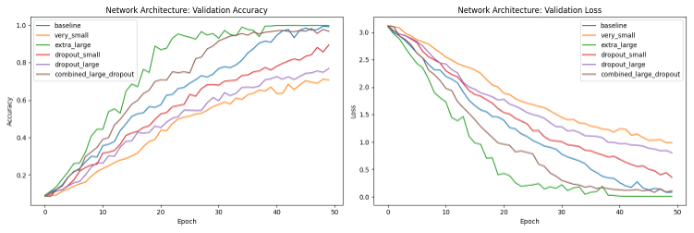
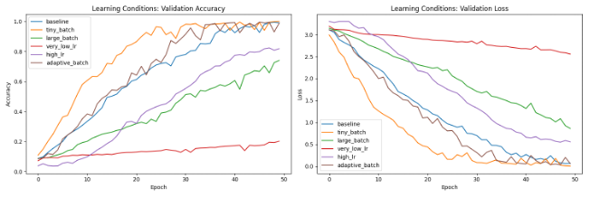

# 🔠 Morse Code Decoder with LSTM

A deep learning model that **translates Morse code into English text** using a sequence-to-sequence architecture based on LSTMs.  
This project was built and tuned as part of a uni assignment for the course _Pattern Recognition in Audio Signals_.

---

## 💡 Features

- 🔁 **Bidirectional Morse encoder/decoder**
- 🧠 **LSTM-based neural network** with tunable architecture
- ⚙️ Experiments with:
  - Different hidden layer sizes (100 to 600 units)
  - Dropout regularization
  - Learning rates & batch sizes
- 📊 Visualization of training & validation accuracy/loss

---

## 🖼️ Model Performance

### 🧱 Network Architectures

_Experiment showing how different LSTM layer sizes and dropout values impact performance._

### ⚙️ Learning Conditions

_Comparison of different batch sizes and learning rates._

---

## 📈 Key Results

- 🧠 600 hidden units = best performance (~98% accuracy by epoch 20)
- 🛡 Dropout 0.2 = prevents overfitting
- ⚡ Batch size 16 + learning rate 0.001 = fast and stable learning

---

## 📚 Academic Context

Course: **Pattern Recognition in Audio Signals**  

Inspired by [Jozefowicz et al. (2015)](https://dl.acm.org/doi/10.5555/3045118.3045367)

---

## 💡 Future Ideas

- Add support for variable-length Morse sequences
- Integrate attention mechanisms
- Build a simple user interface (web or CLI)

---

For educational purposes ✨
